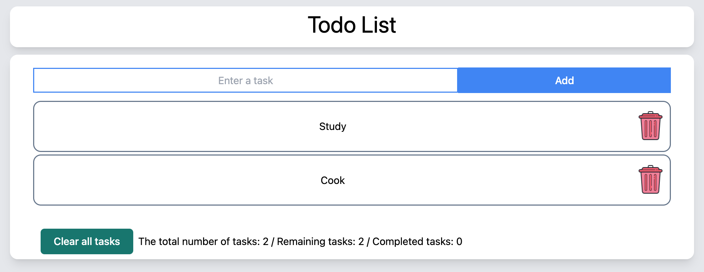

# ToDo project using ReactJS

This project was bootstrapped with [Create React App](https://github.com/facebook/create-react-app).

## Available Scripts

In the project directory, you can run:

### `npm install`

This command is necessary to run the project.

### `npm start`

If you want to run this app.\
Open [http://localhost:3000](http://localhost:3000) to view it in your browser.
### `npm test`

Launches the test runner in the interactive watch mode.information.

### `npm run build`

Builds the app for production to the `build` folder.

## More details

The project was build some tools such us:
* React v17.0.2
* TailwindCSS v3.0.23
## Preview project

